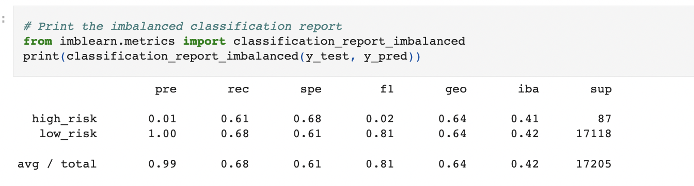
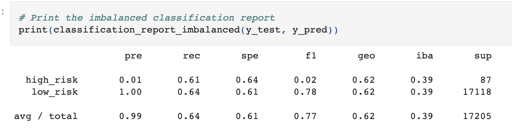
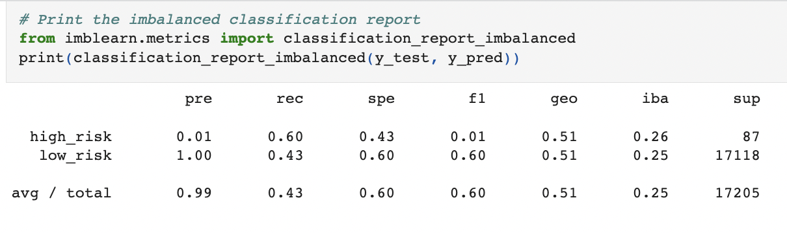
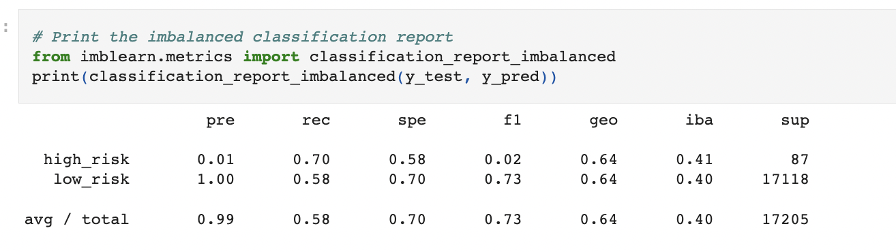
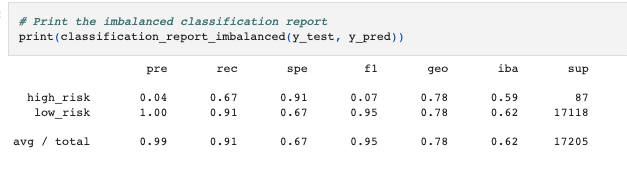
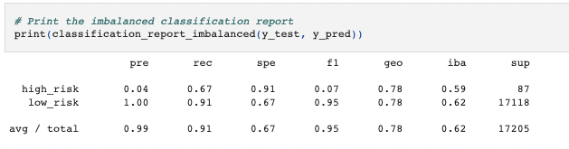

# Credit Risk Analysis
## Overview
Credit risk is an inherently unbalanced classification problem, as good loans easily outnumber risky loans. In this project, I use different techniques to train and evaluate models with unbalanced classes. 

## Resources
Dataset: [LendingClub](https://www.lendingclub.com/)
  Libraries:
- [imbalanced-learn](https://imbalanced-learn.org/stable/) 0.9.1
- [scikit-learn](https://scikit-learn.org/stable/) 1.1.2

## Results
### Model 1: RandomOverSampler 
  - Balanced Accuracy: 65%
  - Precision: 1% 
  - Recall: 61%
### Model 2: SMOTE
  - Balanced Accuracy: 62%
  - Precision: 1%
  - Recall: 61%
### Model 3: Undersampling 
  - Balanced Accuracy: 62%
  - Precision: 1%
  - Recall: 60%
### Model 4: Combination Over & Under Sampling 
  - Balanced Accuracy: 51%
  - Precision: 1%
  - Recall: 70%
### Model 5: BalancedRandomForestClassifier 
  - Balanced Accuracy: 79%
  - Precision: 4%
  - Recall: 67%
### Model 6: EasyEnsembleClassifier
  - Balanced Accuracy: 79%
  - Precision: 4%
  - Recall: 67%

## Summary
The accuracy rating tells us the number of times the ML model was correct overall (for both high-risk and low-risk loans). By this metric, the best performing model was The EasyEnsembleClassifier. However, with imbalanced classes like loans, I think this overall rating can be misleading, because there is are fewer high-risk loans compared to low-risk loans.

If I were a bank, my model focus would be identifying the high-risk loans. So, precision and recall better evalute a model for a specific class, in this case, high-risk loans.

Precision tells us how good the model is at predicting high-risk loans. Are the loans we're classifying as high risk, actually high risk? 
Recall tells us how many times the model was able to detect a specific category. How many high-risk loans were accurately classified compared to all actual high risk loans in the model?

There is a tradeoff between precision and recall. While we certainly want a model to be accurate and precise, I believe the recall is extremely important. As a banker, I would want to make sure I'm not missing out on classifing high-risk loans. With this in mind, Model 4 had the best recall rate of 70%, but a lower accuracy.

Therefore, considering the balance of all three metrics, the EasyEnsembleClassifer is a great model for this data, but I would not discount some of the other models with high recall rates.
